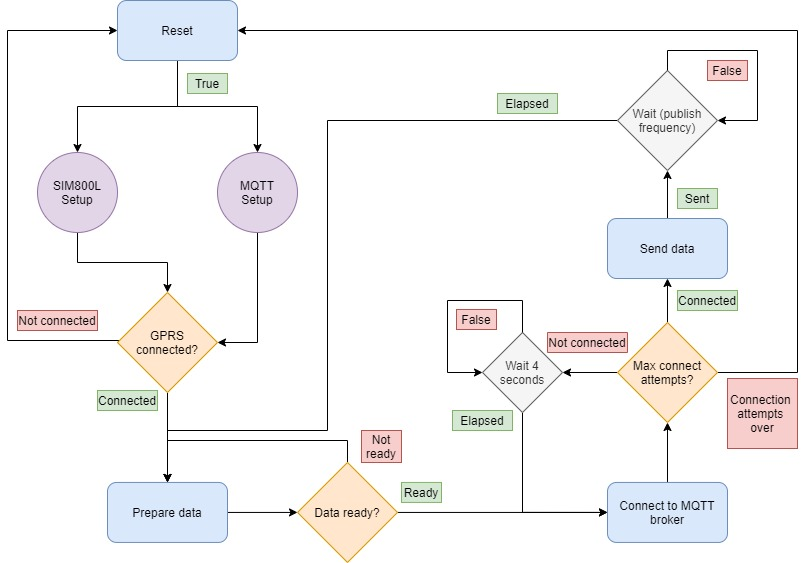

# Connect to any MQTT broker via the cellular network and communicate using Json file format

## Description:

This is an example code for connceting to an MQTT broker with a GPRS connection using the Sim800L module, more specifically, using the TTGO T Call ESP32 board.

## How it works:

The diagram below illustrates the working principle of the code. 

