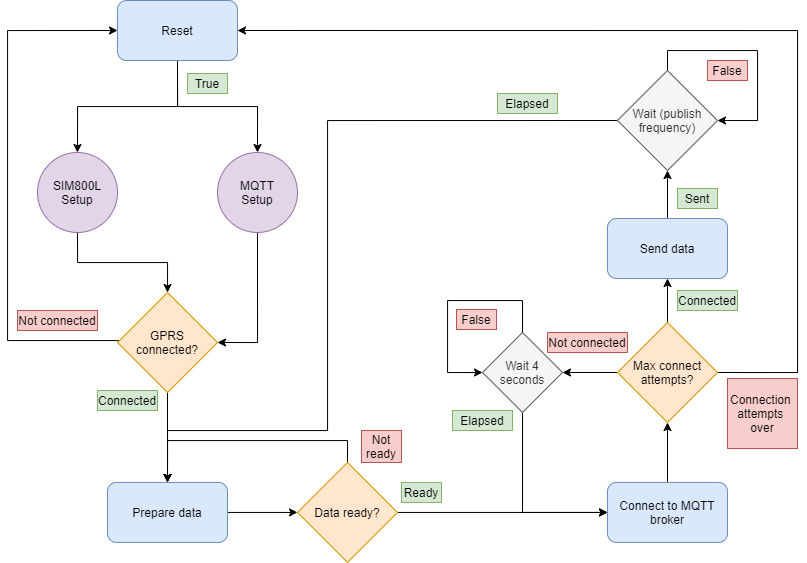

# Connect to any MQTT broker via the cellular network and communicate using Json file format

## Description:

This sketch was written as part of a bigger project in which there are many components in play, which if setup individually and sequentially, would take a long time, hence the need for a parallel approach, which could be seen in the stepped setup approach to the GPRS module, which is a SIM800L module on an ESP32, aka [TTGO T-CALL ESP32](https://github.com/Xinyuan-LilyGO/LilyGo-T-Call-SIM800).

## How it works:

The diagram below illustrates the working principle of the code. 

The code might even be considered as heavily commented, so I hope it'll help prefectly understanding how it works.

